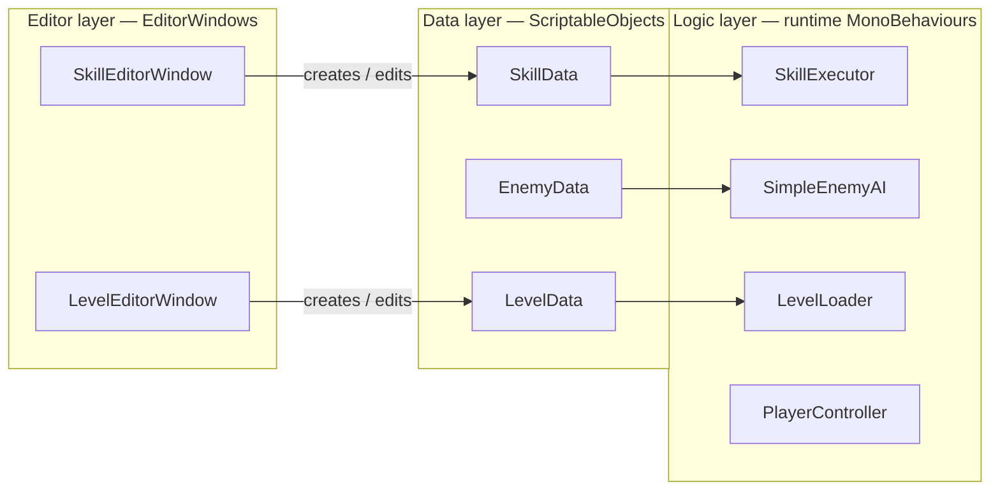

# Unity ARPG Portfolio

Portfolio demo for **game client / tools** roles: one Unity URP project covering  
**(1) gameplay systems**, **(2) custom editors**, **(3) visual & performance work**.

## Quick start

1. Unity Hub → open this folder (Unity **6000.5.x** / URP)  
2. Open `Assets/Scenes/Demo` → **Play**  
3. **WASD** move · **J** / LMB attack · **Q** Cleave · **E** Shockwave  

Menus: **`ARPG Tools > Skill Editor`**, **`Level Editor`**, **`Create Sample Data`**.

Recording shot list: [`Docs/DEMO_VIDEO_SCRIPT.md`](Docs/DEMO_VIDEO_SCRIPT.md)  
Interview crib sheet: [`Docs/INTERVIEW_TALKING_POINTS.md`](Docs/INTERVIEW_TALKING_POINTS.md)

---

## Architecture (OOP / layering)

Logic and tools both depend on **data assets**. Data does not depend on Editor code.



**One-liner for interviews:** skills are data; `SkillExecutor` is the interpreter; editors mutate the same assets designers and runtime share.

---

## Maps to job responsibilities

| JD theme | What this repo shows |
|----------|----------------------|
| Features & logic with sound design | `SkillData` + `SkillExecutor`; AI FSM Patrol→Chase→Attack + Scene Gizmos |
| Game editors / tools (core) | Skill Editor (sliders + damage preview); Level Editor (Scene place → `LevelData` → `LevelLoader`) |
| Visual & performance | Object pool VFX; `MaterialPropertyBlock` hits; shared materials; URP Bloom; Outline / Dissolve shaders |
| DS & algorithms basics | Pool `Queue`; `OverlapSphereNonAlloc`; SO serialization; `AnimationCurve` sampling |
| English R/W | Code identifiers + this README in English |
| Curiosity / learning | See “Learned while building” below |
| Graphics interest | Outline = normal extrusion pass; Dissolve = thresholded noise |

**Editor value caption (use in video):**  
*Configure new skills without code changes — lower designer–programmer iteration cost.*

---

## Controls & demo content

- Combat: capsule player vs ring of enemies, skill CD UI, hit flash / outline, death dissolve  
- AI: yellow = detect range, red = attack range, cyan = patrol area (enable Gizmos in Scene view)  
- Tools: full create→edit→play loops documented in `Docs/DEMO_VIDEO_SCRIPT.md`

---

## Performance notes (show in PPT if not in video)

| Topic | Before (conceptually) | After |
|-------|----------------------|--------|
| VFX spawn | `Instantiate` / `Destroy` each cast | `SimpleObjectPool` `Get` / `Release` (`Queue`) |
| Hit flash | `renderer.material` clones | `MaterialPropertyBlock` + shared materials |
| Look | Flat Built-in look | URP Volume Bloom + ACES |

Capture real Profiler / Stats numbers on your machine; label honestly even if gains are modest. Guide: `Docs/profiler/README.md`.

---

## Data structures & algorithms (talk track)

- **Object pool:** `Queue<GameObject>` for O(1) recycle of inactive VFX.  
- **Queries:** preallocated collider buffer + `OverlapSphereNonAlloc` avoids per-cast array GC.  
- **Levels:** Unity serializes `LevelData` ScriptableObjects — editors write, `LevelLoader` reads the same asset.  
- **Curves:** `AnimationCurve.Evaluate` interpolates keyed samples (damage falloff / level preview).

---

## Graphics — outline (say this in the interview)

Second pass, **Cull Front**, displace vertices along **normals** by `_OutlineWidth`, output solid `_OutlineColor`. That extruded back-faces create a silhouette outline.

Dissolve animates `_Cutoff` against procedural noise and tints an edge band — see `Assets/Shaders/SimpleDissolve.shader`.

---

## Learned while building

Topics practiced end-to-end in this project (call out “first hands-on” if that is true for you):

- Custom Unity `EditorWindow` tooling for designers  
- URP Volume post-processing from runtime bootstrap  
- Small URP HLSL shaders (outline / dissolve)  
- Object pooling for combat VFX  
- Explicit AI finite-state machine with debug Gizmos  

---

## Repo layout

```
Assets/Scripts/   Combat Skills Character AI UI Pooling Level Demo Data
Assets/Editor/    SkillEditor LevelEditor SampleDataGenerator
Assets/Shaders/   SimpleOutline SimpleDissolve
Assets/Scenes/    Demo
Docs/             video script, interview notes, profiler, highlights
```

---

## References (English docs)

- [Unity ScriptableObject](https://docs.unity3d.com/Manual/class-ScriptableObject.html)  
- [Unity EditorWindow](https://docs.unity3d.com/ScriptReference/EditorWindow.html)  
- [URP documentation](https://docs.unity3d.com/Packages/com.unity.render-pipelines.universal@latest)  
- [Writing shaders](https://docs.unity3d.com/Manual/shader-writing.html)  

---

## Build

`File > Build Settings` → include `Assets/Scenes/Demo` → Windows PC.
